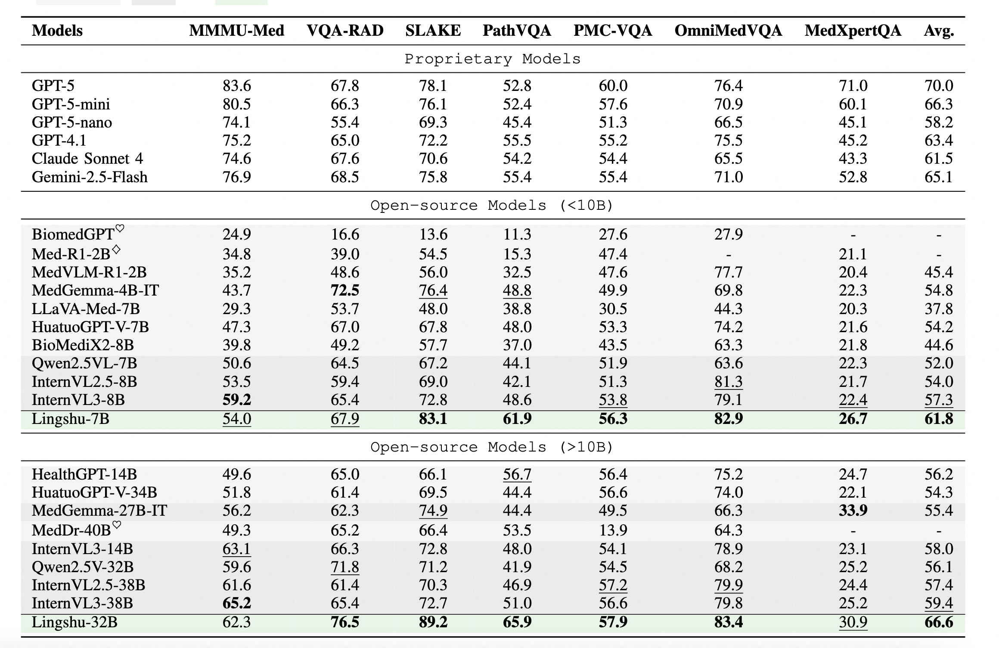
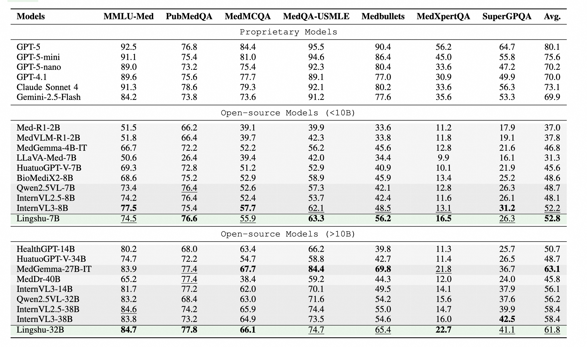

<h3 align="center">
  🩺 MedEvalKit: A Unified Medical Evaluation Framework
</h3>

<p align="center">
  <a href="https://arxiv.org/abs/2506.07044" target="_blank">📖 arXiv Paper</a> •
  <a href="https://huggingface.co/collections/lingshu-medical-mllm/lingshu-mllms-6847974ca5b5df750f017dad" target="_blank">🤗 Lingshu Models</a> •
  <a href="https://alibaba-damo-academy.github.io/lingshu/" target="_blank">🌐 Lingshu Project Page</a>
</p>

<p align="center">
  <a href="https://opensource.org/license/apache-2-0">
    
  </a>
  <a href="https://github.com/alibaba-damo-academy">
    
  </a>
  <a>
    
  </a>
</p>

---

## 📌 Introduction
A comprehensive evaluation framework for **Large Medical Models (LMMs/LLMs)** in the healthcare domain.  
We welcome contributions of new models, benchmarks, or enhanced evaluation metrics!

---

## Eval Results
### MultiModal Eval Results
<p align="center">
  <a>
    
  </a>
</p>

### Text-Only Eval Results
<p align="center">
  <a>
    
  </a>
</p>


## 🔥 Latest News
* **2025-06-12** - Initial release of MedEvalKit v1.0!
---

## 🧪 Supported Benchmarks

| Multimodal Medical Benchmarks | Text-Only Medical Benchmarks |
|-----------------------|----------------------|
| MMMU-Medical-test     | MedQA-USMLE          |
| MMMU-Medical-val      | MedMCQA              |
| PMC_VQA               | PubMedQA             |
| OmniMedVQA            | Medbullets-op4       |
| IU XRAY               | Medbullets-op5       |
| MedXpertQA-Multimodal | MedXpertQA-Text      |
| CheXpert Plus         | SuperGPQA            |
| MIMIC-CXR             | HealthBench          |
| VQA-RAD               | CMB                  |
| SLAKE                 | CMExam               |
| PATH-VQA              | CMMLU                |
| MedFrameQA            | MedQA-MCMLE          |

---

## 🤖 Supported Models
### HuggingFace Exclusive
<div style="column-count: 2;">

* BiMediX2
* BiomedGPT
* HealthGPT
* Janus
* Med_Flamingo
* MedDr
* MedGemma
* NVILA
* Qwen3-VL-LoRA
* VILA_M3

</div>

### HF + vLLM Compatible
<div style="column-count: 2;">

* HuatuoGPT-vision
* InternVL
* Llama_3.2-vision
* LLava
* LLava_Med
* Qwen2_5_VL
* Qwen2_VL

</div>

---

## 🛠️ Installation
```bash
# Clone repository
git clone https://github.com/DAMO-NLP-SG/MedEvalKit
cd MedEvalKit

# Install dependencies
pip install -r requirements.txt
pip install 'open_clip_torch[training]'
pip install flash-attn --no-build-isolation

# For LLaVA-like models
git clone https://github.com/LLaVA-VL/LLaVA-NeXT.git
cd LLaVA-NeXT && pip install -e .
```

---

## 📂 Dataset Preparation
### HuggingFace Datasets (Direct Access)
```python
# Set DATASETS_PATH='hf'
VQA-RAD: flaviagiammarino/vqa-rad
SuperGPQA: m-a-p/SuperGPQA
PubMedQA: openlifescienceai/pubmedqa
PATHVQA: flaviagiammarino/path-vqa
MMMU: MMMU/MMMU
MedQA-USMLE: GBaker/MedQA-USMLE-4-options
MedQA-MCMLE: shuyuej/MedQA-MCMLE-Benchmark
Medbullets_op4: tuenguyen/Medical-Eval-MedBullets_op4
Medbullets_op5: LangAGI-Lab/medbullets_op5
CMMMU: haonan-li/cmmlu
CMExam: fzkuji/CMExam
CMB: FreedomIntelligence/CMB
MedFrameQA: SuhaoYu1020/MedFrameQA
```

### Local Datasets (Manual Download Required)
| Dataset          | Source |
|------------------|--------|
| MedXpertQA       | [TsinghuaC3I](https://huggingface.co/datasets/TsinghuaC3I/MedXpertQA) |
| SLAKE            | [BoKelvin](https://huggingface.co/datasets/BoKelvin/SLAKE) |
| PMCVQA           | [RadGenome](https://huggingface.co/datasets/RadGenome/PMC-VQA) |
| OmniMedVQA       | [foreverbeliever](https://huggingface.co/datasets/foreverbeliever/OmniMedVQA) |
| MIMIC_CXR        | [MIMIC_CXR](https://physionet.org/content/mimic-cxr/2.1.0/) |
| IU_Xray          | [IU_Xray](https://openi.nlm.nih.gov/faq?download=true) |
| CheXpert Plus    | [CheXpert Plus](https://aimi.stanford.edu/datasets/chexpert-plus) |
| HealthBench       | [Normal](https://openaipublic.blob.core.windows.net/simple-evals/healthbench/2025-05-07-06-14-12_oss_eval.jsonl),[Hard](https://openaipublic.blob.core.windows.net/simple-evals/healthbench/hard_2025-05-08-21-00-10.jsonl),[Consensus](https://openaipublic.blob.core.windows.net/simple-evals/healthbench/consensus_2025-05-09-20-00-46.jsonl) |

---

## 🚀 Quick Start
### 1. Configure `eval.sh`
```bash
#!/bin/bash
export HF_ENDPOINT=https://hf-mirror.com
# MMMU-Medical-test,MMMU-Medical-val,PMC_VQA,MedQA_USMLE,MedMCQA,PubMedQA,OmniMedVQA,Medbullets_op4,Medbullets_op5,MedXpertQA-Text,MedXpertQA-MM,SuperGPQA,HealthBench,IU_XRAY,CheXpert_Plus,MIMIC_CXR,CMB,CMExam,CMMLU,MedQA_MCMLE,VQA_RAD,SLAKE,PATH_VQA,MedFrameQA,Radrestruct
EVAL_DATASETS="MMMU-Medical-test" 
DATASETS_PATH="hf"
OUTPUT_PATH="eval_results/medonethinker-qwen3vl-8b-lora-r64"
# TestModel,Qwen2-VL,Qwen2.5-VL,Qwen3-VL-LoRA,BiMediX2,LLava_Med,Huatuo,InternVL,Llama-3.2,LLava,Janus,HealthGPT,BiomedGPT,Vllm_Text,MedGemma,Med_Flamingo,MedDr
MODEL_NAME="Qwen3-VL-LoRA"
MODEL_PATH="sathiiii/medonethinker-qwen3vl-8b-lora-r64"
BASE_MODEL_PATH="Qwen/Qwen3-VL-8B-Instruct"

#vllm setting
CUDA_VISIBLE_DEVICES="0"
TENSOR_PARALLEL_SIZE="1"
USE_VLLM="False"

#Eval setting
SEED=42
REASONING="False"
TEST_TIMES=1


# Eval LLM setting
MAX_NEW_TOKENS=8192
MAX_IMAGE_NUM=6
TEMPERATURE=0
TOP_P=0.0001
REPETITION_PENALTY=1

# LLM judge setting
USE_LLM_JUDGE="False"
# gpt api model name
GPT_MODEL="gpt-4.1-2025-04-14"
JUDGE_MODEL_TYPE="openai"  # openai or gemini or deepseek or claude
API_KEY=""
BASE_URL=""


# pass hyperparameters and run python sccript
python eval.py \
    --eval_datasets "$EVAL_DATASETS" \
    --datasets_path "$DATASETS_PATH" \
    --output_path "$OUTPUT_PATH" \
    --model_name "$MODEL_NAME" \
    --model_path "$MODEL_PATH" \
    --base_model_path "$BASE_MODEL_PATH" \
    --seed $SEED \
    --cuda_visible_devices "$CUDA_VISIBLE_DEVICES" \
    --tensor_parallel_size "$TENSOR_PARALLEL_SIZE" \
    --use_vllm "$USE_VLLM" \
    --max_new_tokens "$MAX_NEW_TOKENS" \
    --max_image_num "$MAX_IMAGE_NUM" \
    --temperature "$TEMPERATURE"  \
    --top_p "$TOP_P" \
    --repetition_penalty "$REPETITION_PENALTY" \
    --reasoning "$REASONING" \
    --use_llm_judge "$USE_LLM_JUDGE" \
    --judge_model_type "$JUDGE_MODEL_TYPE" \
    --judge_model "$GPT_MODEL" \
    --api_key "$API_KEY" \
    --base_url "$BASE_URL" \
    --test_times "$TEST_TIMES" 
```

### 2. Run Evaluation
```bash
chmod +x eval.sh  # Add execute permission
./eval.sh
```

---

## 📜 Citation
```bibtex
@article{xu2025lingshu,
  title={Lingshu: A Generalist Foundation Model for Unified Multimodal Medical Understanding and Reasoning},
  author={Xu, Weiwen and Chan, Hou Pong and Li, Long and Aljunied, Mahani and Yuan, Ruifeng and Wang, Jianyu and Xiao, Chenghao and Chen, Guizhen and Liu, Chaoqun and Li, Zhaodonghui and others},
  journal={arXiv preprint arXiv:2506.07044},
  year={2025}
}
```

<div align="center">
  <sub>Built with ❤️ by the DAMO Academy Medical AI Team</sub>
</div>
